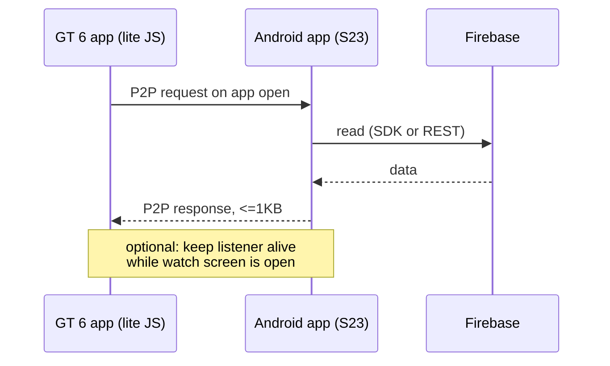

# Reading Firebase data on the Watch GT 6 — Feasibility

Investigation: can this lite wearable app show data from Firebase? Scope is personal
use only, on a **Watch GT 6** paired to a **Samsung S23 (Android)**.

Use case: *open the watch app, see current dashboard data.* Not background alerting —
that is already handled by Telegram bot messages.

## Verdict

**Viable.** An Android companion app is required as a mediator, but the "open it and
look" use case is the easy version of this problem — it sidesteps the platform's
worst limitation.

## Why the watch cannot talk to Firebase directly

Two independent blockers:

1. **No network hardware path.** The GT 6 has Bluetooth (BT 6.0, BR+BLE) and NFC.
   **No Wi-Fi, no eSIM, no LTE.** Its only route to the internet is the paired phone.
2. **No background execution.** The lite wearable runtime cannot run apps in the
   background: "App can not run in the background, and cannot be resumed in the same
   state."

A Firebase SDK on-device is impossible regardless: no WebSocket support, an old JS
dialect, 10 MB app / 48 KB-per-page budget.

## Architecture

**Request/response on open, not a persistent push pipeline.** The watch asks when it
starts; the phone fetches and replies. Optionally the phone keeps a Firebase listener
alive for the few minutes the watch screen is on, so values update while you look.

This matters: you do **not** need a 24/7 foreground service holding a Firebase
connection, which is the part that OEM battery managers break. The phone only works
when the watch asks.

## The constraint that will actually shape this: 1 KB

| Channel | Limit |
|---|---|
| **P2P text message** | **1 KB** |
| File transfer phone → watch | 100 MB |
| File transfer watch → phone | 4 MB |

1 KB is the whole budget for a dashboard payload. Design consequences:

- **Do all work on the phone.** Filter, sort, round, format there. Send the watch
  display-ready values, never raw Firebase documents.
- **Use short keys and compact encoding.** `{"t":142.5,"d":-2.1}`, not
  `{"currentTarget": 142.5, "dailyDelta": -2.1}`.
- **Paginate by screen.** One message per watch screen. If you need more, the watch
  requests page 2 rather than the phone pushing everything.
- File transfer exists as an escape hatch for larger payloads, but it is clumsy for
  frequently-changing values — treat 1 KB as the real design budget.

Combined with the **48 KB per page** and **no router back stack** limits, the watch app
should be a small number of flat, mostly-static screens whose text nodes get updated.

## Prerequisites

- **Apply for Wear Engine** in the Huawei developer console (App Services → Wear Engine
  → Apply). Two spreadsheets required: *Data Permission and Usage Description* and
  *User Authorization Path Description*. **Individuals are eligible.** Reported
  turnaround ranges from 3–5 days to ~2 weeks. Nothing P2P is testable until it clears,
  so apply before building.
- **`wearengine.js`** in `entry/src/main/js/MainAbility/wearengine/`.
- **`PEER_PKG_NAME` + `PEER_FINGERPRINT`** on both sides. The fingerprint comes from the
  Android app's signing cert, so that signing config must be stable — if you re-sign the
  Android app, the pairing breaks.
- **`DEVICE_MANAGER`** permission on the Android side.
- Watch paired in Huawei Health; both apps installed.

## API surface

**Android:** `HiWear.getP2pClient()` → `send()`, `registerReceiver()`, `getAppVersion()`
(returns -1 if the watch app is not installed), `ping()`.

**Watch (FA model, matches this project):** `new P2pClient()`,
`setPeerPkgName()`, `setPeerFingerPrint()`, `p2pClient.send()`, receive callback.
Binary conversion via `textEncoder.encodeInto()`.

## Which Firebase product?

Worth settling before writing the companion. Your dashboards project keeps per-user
state in **Firestore**, not Realtime Database — different SDK and different REST
semantics, though from the watch's perspective nothing changes since the phone does all
Firebase work.

- **Firestore**: `addSnapshotListener` for live, `get()` for one-shot. Fine either way.
- **Realtime Database**: `ValueEventListener`, or REST with `Accept: text/event-stream`
  for SSE streaming.

If the watch only reads on open, a one-shot `get()` is simpler and cheaper than a
listener, and avoids holding any connection at all.

## Wear Engine application — verified details

Confirmed against Huawei's docs (page last updated 2026-04-08) and the live consoles.

**It is not in AppGallery Connect.** Searching AGC for "wear" returns nothing, in both
*Manage open capabilities* and *Manage APIs*, because Wear Engine lives in the separate
**HUAWEI Developer Console**: *Console -> App services -> Development -> Wear Engine ->
Apply for Wear Engine*.

**Individual developers can only apply for two permissions:** *Basic device information*
and *Message notification*. That sounds fatal but is not — the permission table shows
**P2P messaging sits under Basic device information**, not under some restricted tier:

| Permission | Open capability | Covers |
|---|---|---|
| **Basic device information** (`DEVICE_MANAGER`) | Wearable device status management | List paired devices, battery, connection status, available space |
| | **Communications management** | **Sending P2P messages or files; receiving P2P messages or files** |
| Message notification (`NOTIFY`) | Message notification management | Push templated notifications to the watch |
| Wearable user status (`WEAR_USER_STATUS`) | — | Wearing status, heart rate alerts |
| Human body sensor | — | Restricted to professional research institutions |

So **tick Basic device information only.** Message notification is redundant here.

Form fields to expect:

- **Product Type**: Android App (iOS App and HarmonyOS App also listed)
- **Select**: the registered Android app — requires HUAWEI ID service applied for it
- **APK Name**
- **Basic information**: which wearables to support — for a GT 6 choose
  **Harmony Lightweight Smart Wearable Device**
- **Is an application developed on the wearable device?** → **Yes**
- Two uploads: *data permission and use instructions*, and *description of user
  authorization paths*. Both have a **Download Example** link on the form itself; Excel
  or PDF, under 10 MB.

### Two constraints found in the application fine print

1. **"The following capabilities require that your mobile app be running in the
   foreground and the Huawei Health app be running properly in the background."**
   This bears directly on the wake question. Read strictly it means the phone app must
   be on screen; read as Android terminology it means a foreground *service* (persistent
   notification) is enough, which is what the reference projects do. Assume a foreground
   service is needed and verify with the hello-world round trip before building on it.
2. **"If you want to support non-Huawei Android phones, check whether the Huawei Health
   app can run in the background on these phones."** The S23 is a non-Huawei phone, so
   Huawei Health needs a battery-optimisation exemption in Samsung's settings or the
   link dies silently.

Also noted: **"The wearable capability does not support iOS devices"** — the Android
phone is not just convenient here, it is required.

### Still to verify

Whether an incoming P2P message can start a force-stopped Android app, or whether the
companion must always be alive. Test: build the hello-world P2P round trip, force-stop
the Android app, open the watch app, see whether anything arrives. Do this before
writing any Firebase code.

## Reference implementations

- **[Home-Assistant-HarmonyOS-Next](https://github.com/gentslava/Home-Assistant-HarmonyOS-Next)**
  — closest precedent. Explicitly supports **Watch GT 4/5/6** with a lite-JavaScript app
  plus Android companion over Wear Engine P2P, with a shared versioned protocol. Also
  confirms "Watch GT physically rejects third-party ArkTS Stage applications". Read its
  P2P protocol design before inventing your own.
- **[LiveScore-Wearable-Demo](https://github.com/minkiapps/LiveScore-Wearable-Demo)** —
  live data on lite wearables (GT2 Pro, GT Runner, GT3, GT3 Pro, Fit2); Android app
  fetches and relays via Wear Engine.
- **[sportwatch-wear-engine-lite-wearable-to-mobile](https://github.com/Explore-In-HMOS-Wearable/sportwatch-wear-engine-lite-wearable-to-mobile)**
  — minimal Huawei sample for the lite wearable side: `wearengine.js` placement, peer
  config, message send/receive.

## Sources

- [Huawei Watch GT 6 specifications](https://consumer.huawei.com/en/wearables/watch-gt6/specs/) — connectivity, no Wi-Fi
- [P2P Communication Between Android and HarmonyOS Wearable (FA + Stage Model)](https://dev.to/harmonyos/p2p-communication-between-android-and-next-wearable-fa-stage-model-device-technical-guide-3d9e) — APIs, size limits
- [HarmonyOS dev guide — lite wearable limitations](https://github.com/megaacheyounes/harmonyos-dev-guide)
- [What is Huawei Wear Engine? How to Apply](https://medium.com/huawei-developers/what-is-huawei-wear-engine-how-to-apply-for-huawei-wear-engine-c039a3b02d6d)
- [Wear Engine — Huawei Developers](https://developer.huawei.com/consumer/en/hms/huawei-wearengine)
